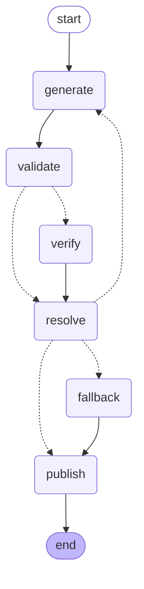

# GATE-CS Agent

Agentic pipeline that generates, verifies, and publishes daily GATE Computer Science practice questions to a Telegram channel. The system uses a dual-LLM architecture where one model generates a question and a second model independently solves it. Questions are published only when both models agree on the answer.

## Architecture

The pipeline is orchestrated as a 6-node LangGraph state graph with conditional routing and automatic retries.



| Node | What it does |
|------|-------------|
| **generate** | Calls the generator LLM to produce a GATE-style question for each slot |
| **validate** | Runs structural checks: option count, duplicates, answer-leak detection, Telegram length limits |
| **verify** | Calls a separate verifier LLM to independently solve the question from scratch |
| **resolve** | Compares generator and verifier answers using type-specific comparators; routes to retry, fallback, or publish |
| **fallback** | On retry exhaustion, attempts to serve a previously verified question from the local cache |
| **publish** | Formats and sends the question to Telegram via the Bot API, then logs the outcome to SQLite |

Conditional edges handle three routing decisions:
- **After validate:** skip verification if no question passed structural checks
- **After resolve:** retry generation if retries remain, fall back to cache if exhausted, publish if all slots resolved
- **Retry loop:** resets generated/validation/verifier state and re-enters the generate node

## Tech Stack

| Component | Library |
|-----------|---------|
| LLM provider | [Groq](https://groq.com) via `langchain-groq` |
| Pipeline orchestration | [LangGraph](https://langchain-ai.github.io/langgraph/) |
| Structured output | [Pydantic](https://docs.pydantic.dev/) v2 with `json_schema` |
| Observability | [LangSmith](https://smith.langchain.com/) tracing + SQLite logging |
| Publishing | [python-telegram-bot](https://python-telegram-bot.org/) |
| Package management | [uv](https://docs.astral.sh/uv/) |
| CI/CD | GitHub Actions (daily cron + manual dispatch) |
| Python | 3.13+ |

## Design Patterns

- **Strategy pattern** via registry dicts for validators, comparators, LLM schemas, and publishers. No `if/elif` dispatch on question type in core logic.
- **Dependency injection** via LangGraph's `RunnableConfig`. All external dependencies (LLM, Telegram, database, cache) are passed at invoke time through `config["configurable"]`. The composition root is `main.py`.
- **Defensive LLM parsing.** `VerifierPayload` defaults confidence to 1 (lowest) and reasoning to empty string, preventing parse failures when the model omits optional fields.

## Question Types

| Type | Format | Answer | Telegram format |
|------|--------|--------|----------------|
| MCQ | 4 options, single correct | Option label (A-D) | Native quiz poll |
| MSQ | 4 options, multiple correct | List of labels | Regular poll + spoiler text |
| NAT | No options, numeric answer | Float | Text message with spoiler |

## Environment Variables

| Variable | Required | Description |
|----------|----------|-------------|
| `GROQ_API_KEY` | Yes | Groq API key |
| `TELEGRAM_BOT_TOKEN` | Yes | Telegram Bot API token |
| `TELEGRAM_CHANNEL_ID` | Yes | Target Telegram channel ID |
| `LANGSMITH_API_KEY` | Yes | LangSmith API key for tracing |
| `LANGSMITH_TRACING` | No | Enable tracing (default: `true`) |
| `LANGSMITH_PROJECT` | No | LangSmith project name (default: `gate-cs-agent`) |
| `LANGSMITH_ENDPOINT` | No | LangSmith API endpoint |

Copy `.env.example` or create a `.env` file with the required variables.

## Running Locally

```bash
# install dependencies
uv sync

# run the pipeline
uv run gate-cs-agent

# run tests
uv run pytest tests/ -v
```

The pipeline is idempotent per day. If all slots for today are already logged in `daily_log.db`, the run exits early.

## Reliability

Observed over 7 daily runs (21 total question slots) from local `daily_log.db`:

| Metric | Value |
|--------|-------|
| Slots published | 16 / 21 (76%) |
| Slots failed (retry exhausted) | 5 / 21 |
| Average latency per published slot | ~5 seconds |
| Verifier confidence (published) | 5/5 on all published slots |
| Days with at least one question published | 7 / 7 (100%) |

Failure mode is exclusively `retry_exhausted` (the verifier and generator could not agree within the retry budget). No schema failures, no Telegram publish failures, no crashes.

## Project Structure

```
src/
    domain.py          Pydantic models, enums, type aliases
    config.py          Constants, settings, daily slot picker
    llm.py             Prompt templates and LLM chain builders
    validators.py      Structural validators (MCQ, MSQ, NAT)
    comparators.py     Answer comparators with tolerance
    graph.py           LangGraph pipeline and node definitions
    publishing.py      Telegram client and message formatters
    observability.py   SQLite logger and verified question cache
    main.py            Entry point and dependency wiring
data/
    syllabus.json      GATE CS subjects and subtopics
    examples.json      Few-shot examples for generation
tests/
    test_pipeline.py   Unit tests for formatting and logging
    test_validators.py Unit tests for structural validators
    test_comparators.py Unit tests for answer comparators
```

## License

MIT
